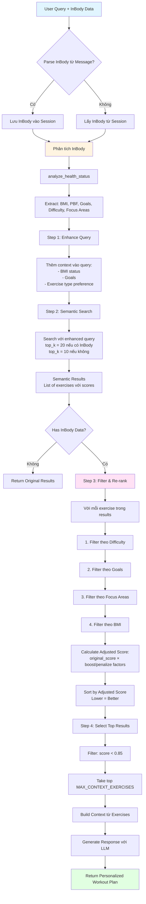

# Option 2: Personalized Exercise Recommendations với InBody Data

## Tổng Quan

Option 2 là phương pháp **hybrid** kết hợp **semantic search** với **post-filtering và re-ranking** dựa trên dữ liệu InBody để cá nhân hóa gợi ý bài tập cho từng người dùng.

---

## Sơ Đồ Flow Hoạt Động



---

## Chi Tiết Từng Bước

### Step 1: Parse & Analyze InBody Data

```python
# Parse InBody từ message (JSON hoặc text)
parsed_inbody = parse_inbody_from_message(message)

# Lưu vào session
set_inbody_data(session_id, parsed_inbody)

# Phân tích InBody
analysis = analyze_health_status(inbody_data)
```

**Output từ `analyze_health_status`:**

- `bmi`: Chỉ số BMI
- `body_fat_percentage`: Tỷ lệ mỡ cơ thể
- `goals`: Danh sách mục tiêu (["Giảm cân", "Giảm mỡ", "Tăng cơ", ...])
- `recommended_difficulty`: Độ khó phù hợp ("BASIC", "MODERATE", "ADVANCED")
- `focus_areas`: Khu vực cần tập trung (["Core", "Cardio", "Full Body", ...])
- `health_status`: Tình trạng sức khỏe ("good", "needs_improvement")

---

### Step 2: Enhance Query với InBody Context

```python
enhanced_query = _enhance_query_with_inbody(message, inbody_data)
```

**Logic:**

- Nếu BMI < 18.5 → Thêm: "cho người gầy cần tăng cân tăng cơ"
- Nếu BMI >= 25 → Thêm: "cho người thừa cân cần giảm mỡ"
- Nếu goals có "tăng cân/tăng cơ" → Thêm: "ưu tiên bài tập tăng cơ"
- Nếu goals có "giảm mỡ/giảm cân" → Thêm: "ưu tiên bài tập đốt mỡ cardio"

**Ví dụ:**

```
Input:  "cho tôi lộ trình tập luyện"
Output: "cho tôi lộ trình tập luyện. cho người thừa cân cần giảm mỡ, ưu tiên bài tập đốt mỡ cardio"
```

---

### Step 3: Semantic Search với Enhanced Query

```python
search_top_k = 20 if inbody_data else 10
semantic_results = semantic_search(enhanced_query, top_k=search_top_k)
```

**Tại sao top_k = 20?**

- Cần nhiều options để filter và re-rank
- Semantic search trả về các bài tập liên quan đến query
- Mỗi result có `score` (lower = better similarity)

**Output:**

```python
[
    {
        "raw": {...exercise_data...},
        "score": 0.75,  # Similarity score
        "metadata": {...}
    },
    ...
]
```

---

### Step 4: Filter & Re-rank dựa trên InBody

Đây là **core logic** của Option 2.

#### 4.1. Filter theo Difficulty

```python
if recommended_difficulty == "BASIC":
    if exercise.difficulty == "BASIC" or "BEGINNER":
        adjusted_score *= 0.9  # Boost
    elif exercise.difficulty == "MODERATE" or "ADVANCED":
        adjusted_score *= 1.1  # Penalize
```

**Logic:**

- **BASIC/BEGINNER users**: Ưu tiên bài tập BASIC/BEGINNER, tránh ADVANCED
- **MODERATE users**: Có thể làm BASIC, BEGINNER, MODERATE, tránh ADVANCED
- **ADVANCED users**: Có thể làm tất cả, ưu tiên ADVANCED

#### 4.2. Filter theo Goals

```python
if goals contains "giảm mỡ" or "giảm cân":
    if "cardio" in exercise.name or "hiit" in exercise.name:
        adjusted_score *= 0.85  # Strong boost
    if "full body" in exercise.muscle_group:
        adjusted_score *= 0.9   # Boost
    if exercise.calories > 200:
        adjusted_score *= 0.9   # Boost high calorie exercises

if goals contains "tăng cơ" or "tăng cân":
    if "builder" in exercise.name or "build" in exercise.name:
        adjusted_score *= 0.85  # Strong boost
    if "cardio" in exercise.name and "light" not in exercise.name:
        adjusted_score *= 1.1   # Penalize heavy cardio
```

**Logic:**

- **Giảm mỡ**: Ưu tiên Cardio, HIIT, Full Body, High Calories
- **Tăng cơ**: Ưu tiên Strength, Builder, tránh Cardio nặng

#### 4.3. Filter theo Focus Areas

```python
if "Core" in focus_areas:
    if "core" in exercise.name or "abs" in exercise.name:
        adjusted_score *= 0.9  # Boost

if "Cardio" in focus_areas:
    if "cardio" in exercise.name or "hiit" in exercise.name:
        adjusted_score *= 0.9  # Boost

if "Full Body" in focus_areas:
    if "full body" in exercise.muscle_group:
        adjusted_score *= 0.9  # Boost
```

**Logic:**

- Match focus areas với exercise keywords
- Boost các bài tập phù hợp với focus areas

#### 4.4. Filter theo BMI cụ thể

```python
if bmi < 18.5:  # Gầy
    if "cardio" in exercise.name and "light" not in exercise.name:
        adjusted_score *= 1.15  # Penalize heavy cardio
    if "builder" in exercise.name or "build" in exercise.name:
        adjusted_score *= 0.85   # Boost strength exercises

if bmi >= 25:  # Thừa cân
    if "cardio" in exercise.name or "hiit" in exercise.name:
        adjusted_score *= 0.85  # Boost cardio
    if "advanced" in exercise.difficulty:
        adjusted_score *= 1.1   # Penalize if too hard
```

**Logic:**

- **BMI < 18.5**: Tránh Cardio nặng, ưu tiên Strength
- **BMI >= 25**: Ưu tiên Cardio, tránh bài tập quá khó

---

### Step 5: Sort & Select Top Results

```python
# Sort by adjusted_score (lower = better)
filtered.sort(key=lambda x: x["adjusted_score"])

# Filter: chỉ lấy results có score < 0.85 (good similarity)
good_results = [item for item in filtered if item.get("score") < 0.85]

# Take top MAX_CONTEXT_EXERCISES (default: 10)
top_results = good_results[:MAX_CONTEXT_EXERCISES]
```

**Logic:**

- Sắp xếp theo `adjusted_score` (đã được điều chỉnh)
- Chỉ lấy results có semantic similarity tốt (score < 0.85)
- Lấy top N exercises để đưa vào context

---

### Step 6: Generate Response

```python
contexts = build_context_from_exercises(top_results)
response = generate_answer_from_context(message, contexts)
```

**Output:**

- JSON format với lộ trình tập luyện theo tuần
- Hoặc text format với danh sách bài tập được gợi ý

---

## Ví Dụ Cụ Thể

### Input:

```json
{
  "message": "cho tôi lộ trình tập luyện",
  "inbody_data": {
    "composition": { "weight": "86.2" },
    "inbody_info": { "height": "176", "age": "24", "gender": "Male" },
    "obesity": { "bmi": "27.8", "pbf": "25.6" },
    "score": { "score": "76" }
  }
}
```

### Quy Trình:

1. **Parse & Analyze:**

   ```
   BMI: 27.8 (Thừa cân)
   PBF: 25.6% (Hơi cao cho nam)
   Goals: ["Giảm cân", "Giảm mỡ"]
   Recommended Difficulty: "MODERATE"
   Focus Areas: ["Cardio", "Full Body"]
   ```

2. **Enhance Query:**

   ```
   Original: "cho tôi lộ trình tập luyện"
   Enhanced: "cho tôi lộ trình tập luyện. cho người thừa cân cần giảm mỡ, ưu tiên bài tập đốt mỡ cardio"
   ```

3. **Semantic Search:**

   - Tìm top 20 bài tập liên quan đến "lộ trình tập luyện" + context
   - Results bao gồm: "All Over Hiit-up", "Light cardio", "Full Body Strengthening", "Chest Builder", ...

4. **Filter & Re-rank:**

   | Exercise                | Original Score | Difficulty Filter    | Goals Filter                | Focus Areas     | BMI Filter     | Adjusted Score |
   | ----------------------- | -------------- | -------------------- | --------------------------- | --------------- | -------------- | -------------- |
   | All Over Hiit-up        | 0.72           | 0.9 (MODERATE match) | 0.85 (cardio boost)         | 0.9 (Full Body) | 0.85 (BMI>=25) | **0.42**       |
   | Light cardio            | 0.68           | 0.9 (BASIC match)    | 0.85 (cardio boost)         | 0.9 (Cardio)    | 0.85 (BMI>=25) | **0.38**       |
   | Full Body Strengthening | 0.75           | 0.9 (MODERATE match) | 1.0 (neutral)               | 0.9 (Full Body) | 1.0 (neutral)  | **0.61**       |
   | Chest Builder           | 0.78           | 1.0 (neutral)        | 1.1 (penalize - not cardio) | 1.0 (neutral)   | 1.0 (neutral)  | **0.86**       |

5. **Sort & Select:**

   - Sắp xếp: Light cardio (0.38) < All Over Hiit-up (0.42) < Full Body Strengthening (0.61) < Chest Builder (0.86)
   - Top results: Light cardio, All Over Hiit-up, Full Body Strengthening

6. **Generate Response:**
   ```json
   {
     "Thứ hai": ["Light cardio", "Full Body Strengthening"],
     "Thứ ba": ["All Over Hiit-up"],
     "Thứ tư": ["Light cardio"],
     "Thứ năm": ["Full Body Strengthening"],
     "Thứ sáu": ["All Over Hiit-up"],
     "Thứ bảy": ["Light cardio"],
     "Chủ nhật": ["Nghỉ"]
   }
   ```

---

## So Sánh với Các Option Khác

### Option 1: Query Enhancement Only

- **Cách làm**: Chỉ enhance query, không filter results
- **Ưu điểm**: Đơn giản, nhanh
- **Nhược điểm**: Không cá nhân hóa mạnh, phụ thuộc hoàn toàn vào semantic search

### Option 2: Query Enhancement + Post-filtering (Hiện tại)

- **Cách làm**: Enhance query + Filter & Re-rank results
- **Ưu điểm**:
  - Cân bằng giữa semantic relevance và personalization
  - Linh hoạt, có thể điều chỉnh boost/penalize factors
  - Giữ được các bài tập liên quan đến query
- **Nhược điểm**: Phức tạp hơn, cần nhiều logic

### Option 3: Pure InBody-based Filtering

- **Cách làm**: Bỏ qua semantic search, chỉ filter dựa trên InBody
- **Ưu điểm**: Cá nhân hóa mạnh nhất
- **Nhược điểm**:
  - Có thể bỏ qua các bài tập liên quan đến query
  - Không tận dụng được semantic understanding

---

## Boost/Penalize Factors Summary

| Condition                | Action       | Factor | Reason                        |
| ------------------------ | ------------ | ------ | ----------------------------- |
| Difficulty match         | Boost        | 0.9    | Phù hợp với level             |
| Difficulty too hard      | Penalize     | 1.1    | Quá khó, không an toàn        |
| Cardio for fat loss      | Strong boost | 0.85   | Rất phù hợp cho mục tiêu      |
| Strength for muscle gain | Strong boost | 0.85   | Rất phù hợp cho mục tiêu      |
| High calories (>200)     | Boost        | 0.9    | Tốt cho giảm mỡ               |
| Focus area match         | Boost        | 0.9    | Phù hợp với khu vực cần tập   |
| Heavy cardio for thin    | Penalize     | 1.15   | Không phù hợp cho người gầy   |
| Advanced for overweight  | Penalize     | 1.1    | Quá khó cho người mới bắt đầu |

**Lưu ý:**

- Factor < 1.0 = Boost (giảm score = tốt hơn)
- Factor > 1.0 = Penalize (tăng score = tệ hơn)
- Score thấp hơn = Tốt hơn (vì là distance metric)

---

## Code Flow Diagram

```
User Input
    │
    ├─→ Parse InBody Data
    │       │
    │       └─→ analyze_health_status()
    │               │
    │               ├─→ Extract BMI, PBF, Goals
    │               ├─→ Determine Difficulty
    │               └─→ Identify Focus Areas
    │
    ├─→ Enhance Query
    │       │
    │       └─→ _enhance_query_with_inbody()
    │               │
    │               └─→ Add context: BMI status, goals, preferences
    │
    ├─→ Semantic Search
    │       │
    │       └─→ semantic_search(enhanced_query, top_k=20)
    │               │
    │               └─→ Returns: List[Dict] với scores
    │
    └─→ Filter & Re-rank
            │
            └─→ _filter_exercises_by_inbody()
                    │
                    ├─→ For each exercise:
                    │       │
                    │       ├─→ Check difficulty match → adjust score
                    │       ├─→ Check goals match → adjust score
                    │       ├─→ Check focus areas → adjust score
                    │       └─→ Check BMI-specific rules → adjust score
                    │
                    ├─→ Sort by adjusted_score
                    └─→ Return filtered & re-ranked results
```

---

## Kết Luận

Option 2 cung cấp sự **cân bằng tốt** giữa:

- ✅ **Semantic relevance**: Giữ được các bài tập liên quan đến query
- ✅ **Personalization**: Điều chỉnh kết quả dựa trên InBody data
- ✅ **Flexibility**: Có thể fine-tune boost/penalize factors
- ✅ **Safety**: Ưu tiên bài tập phù hợp với fitness level

Phương pháp này đảm bảo rằng người dùng nhận được **gợi ý bài tập vừa liên quan đến câu hỏi, vừa phù hợp với tình trạng sức khỏe và mục tiêu của họ**.
